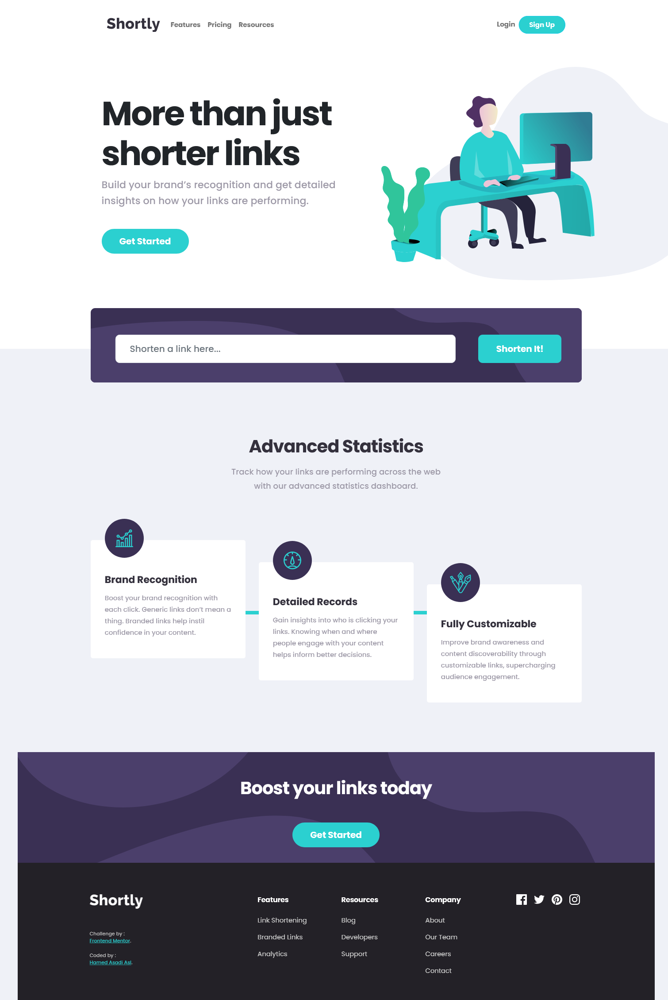

# Shortly URL shortening API

[Shortly URL shortening API Challenge challenge on Frontend Mentor](https://www.frontendmentor.io/challenges/url-shortening-api-landing-page-2ce3ob-G).

### The challenge

Users should be able to:

- View the optimal layout for the site depending on their device's screen size
- Shorten any valid URL
- See a list of their shortened links, even after refreshing the browser
- Copy the shortened link to their clipboard in a single click
- Receive an error message when the `form` is submitted if:
  - The `input` field is empty

### Screenshot

## Links

- Live Site URL: [Shortly URL](https://hamed3958.github.io/shortly-URL/)

### Built with

- HTML5
- CSS
- JavaScript
- Flexbox
- [Bootstrap](https://getbootstrap.com/) - CSS framework
- [Link Shortener · shrtcode](https://shrtco.de/docs/) - URL shortening API

## Author

- Website - [hamedasadiasl.ir](http://hamedasadiasl.ir/)
- Github - [@hamed3958](https://github.com/hamed3958)
- LinkedIn - [Hamed Asadi Asl](https://www.linkedin.com/in/hamed-asadi-asl/)
- Frontend Mentor - [@hamed3958](https://www.frontendmentor.io/profile/hamed3958)
